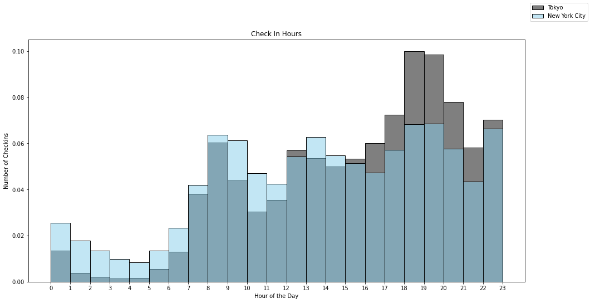
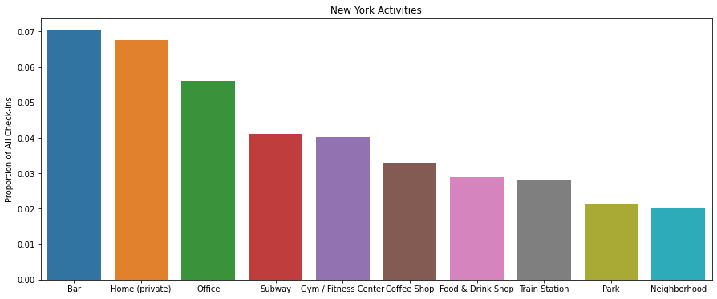
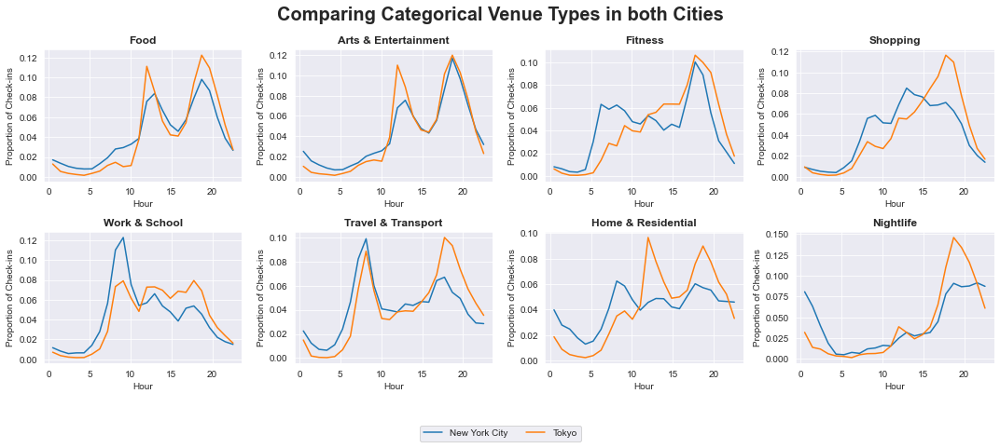
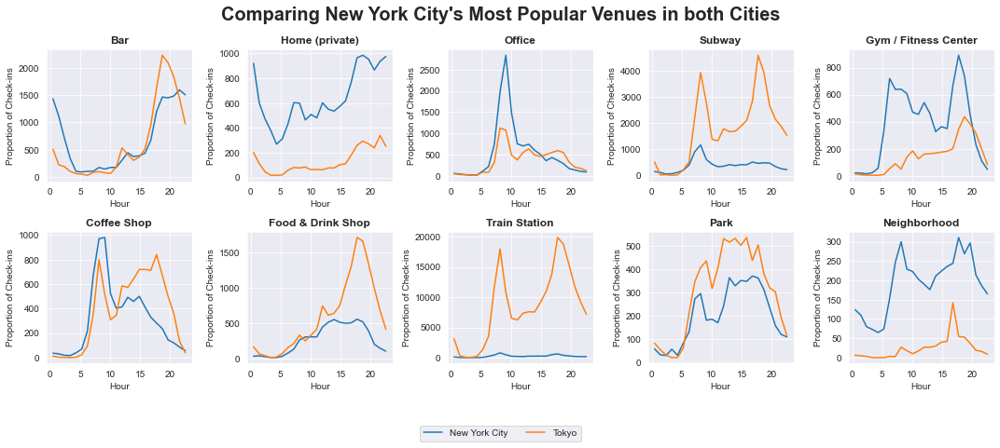
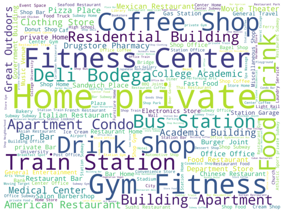
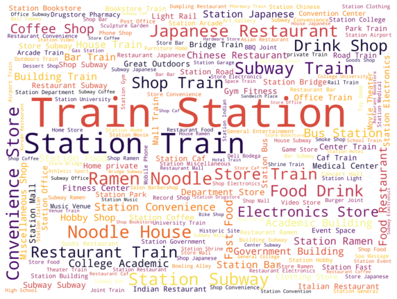
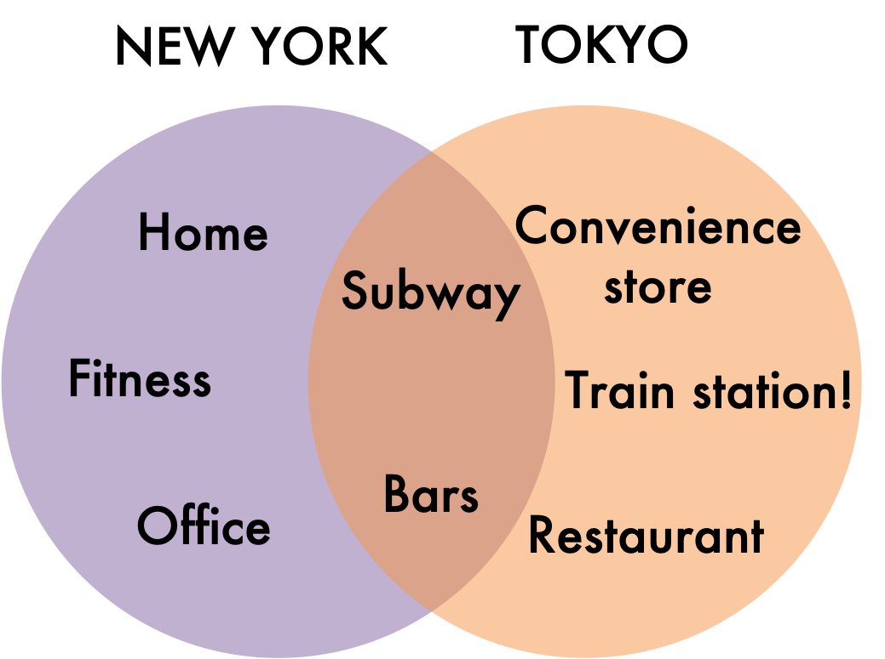

The COVID-19 pandemic has had significant impacts on global health systems, economies, and societies. Governments around the world have implemented a range of measures to try to slow the spread of the virus, including physical distancing, mask-wearing, testing and tracing, and travel restrictions. Here, we will be diving into the complex phenomenon of human movement, covid spread, resources and infrastructure available to support enforcement, and the legal and political context in which the enforcement is taking place, namely 11 countries we selected.

### The Data Used:

The data we acquired comes from GPS activities provided by Apple and Google. The former focuses on geographical mobility shift while the latter focuses on transportation methods change. Also, we add complementary data of demographics, public infrastructure so as to analyse the latent indicators that contribute to the effect of government enforcement during covid.

### Goal:

Different countries take various measures fighting the pandemic and follow a different timeline. How effective they are aginast covid and How they have altered people's daily activities?

Here are some interesting questions which we’ll dive into:
* How fast do governments in different countries respond to the new domestic cases?
* How effective are governments' enforcement on defeating covid? Or say how to measure the performance of covid-fighting measures delivered by governments?
* What are these user’s routines? Do New Yorkers and Tokyoites cluster in specific parts of the city during the day?  Are these cities constantly alive and buzzing as they stereotypically seem to be?
* What activities are done in such megalopolises? How much diversity is there in the activities done?

-----------------

## How fast do governments in different countries respond to the new domestic cases?

After extracting dates of first case and school close date, we generate a timeline of government enforcement speed during covid. Let's take a look at how fast they are among 11 countries we dive to investigate? Can we identify certain patterns?

At first glance, it seems like the earlier the first case emerges, the longer the government takes to suppress it except countries including South Korea, Sweden and Norway. This also means that compared with the date of first case, start date of government intervention varies less. This is quite intuitive given that the coordination between different governments is faster compared with the spread of the virus. For example, Serbia and Finland closed schools even before there is a case under the fact these governments stay informed of the consequences and potential damages the virus could bring by international information sharing system and collaboration.

----------------

## How effective are governments' enforcement on defeating covid? Or say how to measure the performance of covid-fighting measures delivered by governments?
###Method 1: MCA
Multi-criteria analysis (MCA) is a decision-making tool that allows individuals or organisations to evaluate and compare options based on multiple, often conflicting criteria.

How far do people travel from their home?  Are they really discovering new places and being adventurous as they claim to be?

Now that we have estimated where every user lives, let’s see how far from their home they like to explore! Do they wander far off and discover new areas or do they restrict themselves to only their neighborhood?

<!---_(Figure showing the probability distribution according the distance from home in km)!_ -->


Surprisingly, individuals don’t travel that far! According to the plot above, users tend to stay within less than 15 km from their home and rarely wander off.  How far does 15 km look like on a Tokyo and NYC map?
As you can see on both maps, a 15 km radius covers most of the area of both NYC and Tokyo. As a result, if you place an individual in the center of that circle and have them move like a New Yorker or Tokyoite, it will most likely stay within this circle! We can see that they spend most of their time wandering these areas!

------------------

## What are the routines and habits of individuals living in megalopolises?

### 1) Where do people go during the day?
Now let’s focus more on their daily routines: how do people move during the day and where are they located in NYC and Tokyo respectively?

Below are two interactive maps showing where people are distributed over these megalopolises during the day:

<!--- _(add interactive maps with hour by hour evolution of all check-ins)!_ -->
New York:
<iframe src="assets/plots/NYC_hourly.html" width="100%" height="600px"></iframe>
Tokyo:
<iframe src="assets/plots/Tokyo_hourly.html" width="100%" height="600px"></iframe>

In these two maps, we can clearly notice that there is an increase in density during the day (from 6 am - 12 pm), and then in the afternoon that distribution remains the same but the density decreases (12 pm - 6 pm). 
As a result, the center of the respective cities seem to light up during the day, as more and more people are flowing in.  And at the end of the day, some areas are still active, whereas others seem to quiet down.

However, it is important to note that given the important amount of individuals concentrated in these megalopolises, there are still people present in all regions of these respective cities. This could render one of the perks of living in a dense city: the cities are always buzzing with people!

### 2) How active are people during the day?
Another way to look at the user’s movement patterns, is to focus on the time of day that people report their activity on the Foursquare database during a 24 hour period.  In the histogram below, we quantify the activity of users based on the time of day in both cities:

<!--- _(histogram showing check in hours)!_ -->

Globally, both cities show similar trends; a reduced activity during the night which picks up around 7 a.m. all the way to 11 p.m.  However, we do note some differences between these two cities.  On the one hand, Tokyo reveals a higher activity level from 5 p.m. to 11 p.m., but seems to die down.  On the other hand, New York City shows less activity in the late afternoon, but appears to be more active during night time.

According to this graph, we could always consider these cities as “cities that never sleep”, but the night activities still remain notably lower compared to the day!

---------

## What type of activities do New Yorkers and Tokyoites like to do respectively?

What type of activities are most popular in these dense cities?  We ranked the different types of venues for both New York and Tokyo and here’s what appeared to be most popular:

<!--- _(New York histogram)!_ -->

This New York City histogram reveals that one of the most common activities done in this city corresponds to going to bars, followed closely by spending time at home.  As a result, this histogram does reflect this image of a buzzing city with a lot of social encounters.  The following most important activities are going to the office, taking the subway, going to the gym and the coffee shop!

When comparing popular activities in Tokyo, a surprising activity dominates this city: most of the people spend their time at the train station! 

<!--- _(Tokyo histogram with the train station)!_ -->

This dominating activity is followed by people taking the subway and then the following activities are considerably less popular in comparison to being at the train station!
To still get an idea of the scale of the activities other than being at the train station, we removed the first two top activities and looked at the following most popular ones:

<!---_(Tokyo histogram without the train station)!_-->

The popular activities in Tokyo differ surprisingly from those in New York City: Tokyoites tend to prefer Convenience stores and restaurants.  However, the bar is still among the top 5 activities, but being at home does not appear to be one of the top activities.  As a result, this histogram illustrates that Japan seems to be a city, which indulges more in outside activities rather than staying at home as seen in New York City!

We have categorized these venues into the following:
* Food 🍴
* Arts & Entertainment 🎭
* Fitness️🏋️
* Shopping 🛍
* Work & School 📝
* Travel & Transport 🚌
* Home & Residential 🏠
* Nightlife 🌃

<!---_(Comparing categorical venue types in both cities)!_-->

When looking at the distribution of venues according to the day time, similar trends appear between these two megalopolises.  For instance, when looking at the food related-category, we can clearly notice two spikes, around 12pm and around 7pm. It is the same case for Arts & Entertainment and Traveling. However, in terms of fitness, New Yorkers prefer working out before going to work. For shopping, Tokyoites tend to shop later in the evening, as the distribution is more skewed.

Surprisingly, Tokyoite have a spike of going home around lunch time, and it is not the case for New Yorkers: suggesting Tokyoites prefer to eat at home rather than out. Lastly, when comparing nightlife activities, New Yorkers tend to stay up later, whereas Tokyoites go out around dinner time and go home earlier.

To push this comparison even further, let’s look at the top venues for NYC and Tokyo respectively:

|  |
| - |
|  |

From the plots above, it seems that New Yorkers have activities that they prefer overwhelmingly more than Tokyo!  For instance, we can see that New Yorkers tend to go to gyms compared to Tokyo. Equally, most of the New Yorkers like to check-in sharply at 9 am in the morning. This also corresponds to when they get their coffee. Moreover, they spend more time in residential areas, whether it be their home (Home (private)) or their friend's homes (Neighborhood).

As for Tokyo, the preferred venues including electronic stores, ramen/noodle houses and convenience stores dwarf the number of check-ins of New York for the same venues (NYC check-ins are almost flat in comparison). Equally, we notice the extent by which the check-ins related to the train station or the subway in Tokyo dominate those of New York.
<!---_(wordcloud here?)!_-->

| New York | Tokyo |
|:------:|:------:|
|  |  |

------------

## Where can you find the different types of venues?

Imagine you wanted to open the next big brunch spot in New York, or create a new railway to ease traffic in Tokyo. Where would be the best place to place it?

Let’s look at the spatial distribution of the different categories of venues!

New York:

| 🎭 | 🏋️ | 🍴 | 🏠 | 
|:------:|:------:|:------:|:------:|
|  |  |  |  |
| 🌃 | 🛍 | 🚌 | 📝 |
|  |  |  |  |

Tokyo: 

| 🎭 | 🏋️ | 🍴 | 🏠 | 
|:------:|:------:|:------:|:------:|
|  |  |  |  |
| 🌃 | 🛍 | 🚌 | 📝 |
|  |  |  |  |

For both cities, subways and train lines bring residents to the city center (Downtown Manhattan and Central Tokyo). As a result, most venues are clustered in these areas. However, more day-to-day activities like shopping or going to restaurants are more evenly spread out. 

Going back to our hypothetical situation, it could be interesting to open a brunch restaurant in a highly residential suburb where you’d have no competition rather than pay expensive rents downtown. For instance, it could be really advantageous to have publicities in various train stations as Tokyoites spend a considerable amount of time there to help get the word out about your amazing new restaurant!
 
-------------------------

## Is living in a city the same across countries?

Given the numerous questions we addressed in the previous parts, let's conclude by looking at the trends between these two megalopolises and answer some key questions.

For both cities, users tend to travel less than 15 km away from their home. Despite this distance being less than on global scale, there is still plenty to do in their neighborhood! Indeed, users tend to stay near their home, given that there is a diversity of activities nearby.
When looking at the times the activities are done, we can notice that for both megalopolises, most of them occur at the same time of day. For instance, New Yorkers and Tokyoites eat at similar hours and go out approximately around the same time (but not for the same duration). However, some cultural habits clearly stand out: New Yorkers are highly invested in fitness-related activities, which is not the case in Tokyo. Some cuisine preferences have also become apparent, as New Yorkers are more open to different types of food. We can also see an underlying trend where residents of both cities tend to go to the city center downtown during the day, and then disperse as the night comes around.

Time of day | **New York** | **Tokyo**
--------- | ------ | ------
*__06-12__* | Office 💼, Coffee ☕, Gym 🏋️ | Train station 🚉, Subway 🚇, Convenience store 🏪
*__12-18__* | Home 🏠, Office 💼, Food 🍴, Gym 🏋️ | Train station 🚉, Subway 🚇, Restaurants 🍴
*__18-00__* | Bar 🍻, Home 🏠, Gym 🏋️️| Train station 🚉, Subway 🚇, Bars 🍻, Restaurants 🍴
*__00-06__* | Bar 🍻, Home 🏠 | Train station 🚉, Bars 🍻, Convenience Store 🏪

-----------------------

## Conclusion and Implication:

To conclude, big cities share common traits which understandably represent appealing reasons to move. Seeing how densely populated Tokyo and New York City are, there is no doubt that meeting new individuals is effortless.  Moreover, there is a considerable diversity of things to do!  Will you travel and explore farther away from your home than if you lived in some rural city in the Midwest? Probably not, but there is plenty to do right next to you!

<!--- _Venn diagram to compare both cities: !_-->

Such a study and observations can have quite useful implications.  Knowing the user’s locations can definitely contribute to improving urban planning and migration patterns: where would it be useful to construct a new subway line? Would opening a restaurant in Brooklyn work better than opening it in the Bronx?  Such knowledge could also contribute greatly in advertising: when a gym is looking for new memberships, this will enable it to advertise in locations where a lot of people go work out or try to capitalize on a location that doesn’t have many competitors.

Last but not least, understanding this human mobility is valuable information, especially considering the current Covid 🦠 context.  Seeing human movement patterns can help identify regions where the risks are higher and where clusters tend to be most created.

-------------

