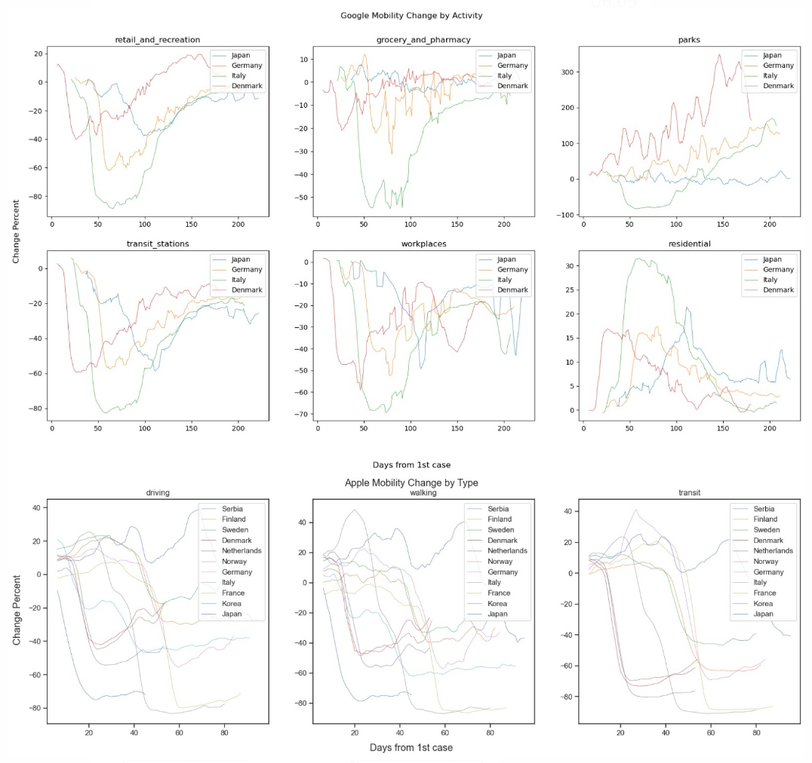
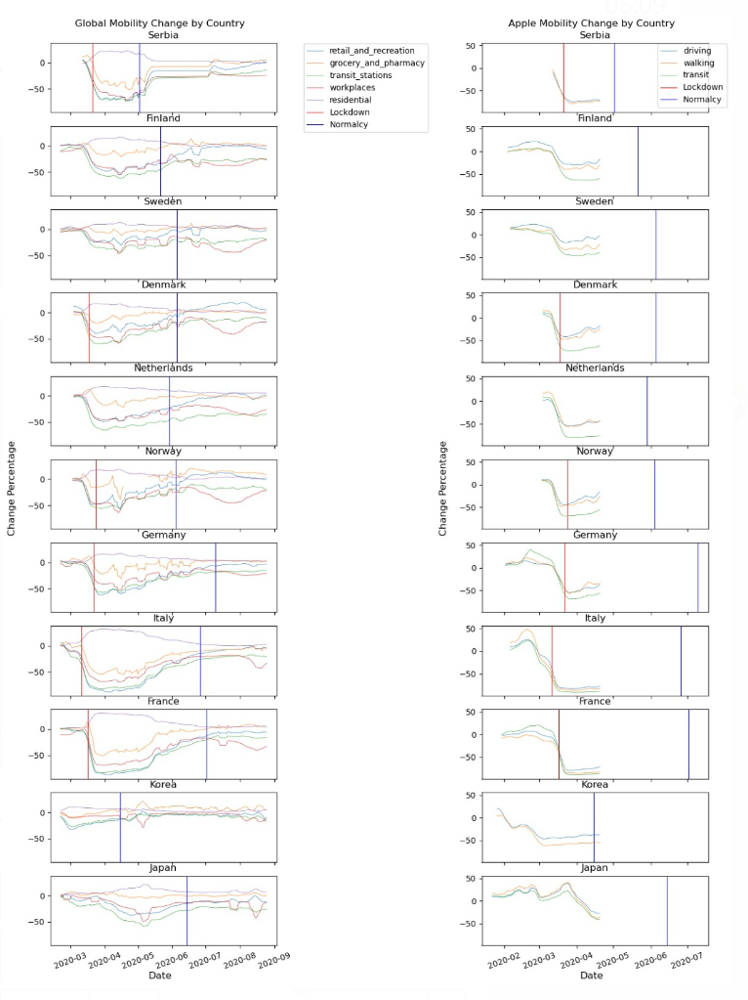
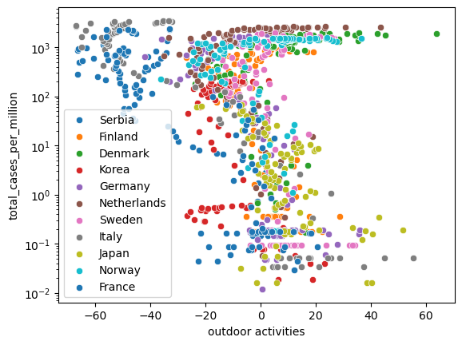
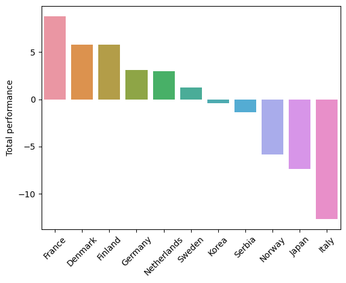
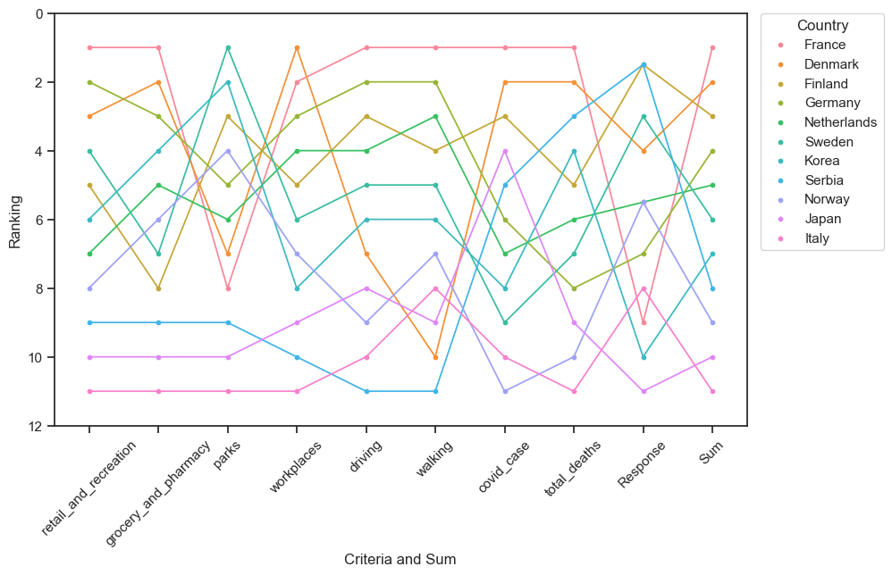
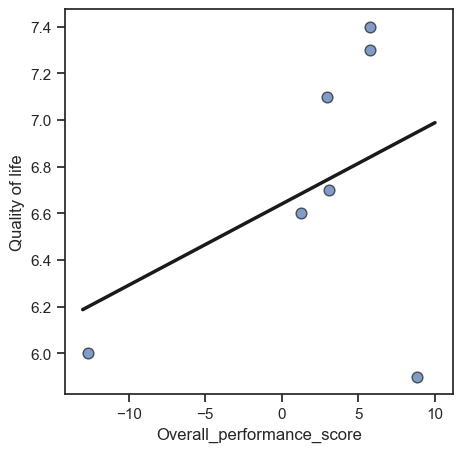

The COVID-19 pandemic has had significant impacts on global health systems, economies, and societies. Governments around the world have implemented a range of measures to try to slow the spread of the virus, including physical distancing, mask-wearing, testing and tracing, and travel restrictions.Now, it’s the third year from the beginning of COVID. As the virulence of the virus (from Alpha to Omicron) is declining and less fear. We are beginning to calm down and think about which shows more influence on human life quality, the virus or the change of normal life. That’s why, here, we think rationally about which government performed best during the COVID. Not just infection rate, but also limitation of mobilities, activities, etc.. Hopefully this will help the government make more comprehensive decisions in the future.

### The Data Used:

<!--  -->

<!-- <iframe src="assets/img/database.png" width="100%" height="600px"></iframe> -->

The data we acquired comes from GPS activities provided by Apple and Google. The former focuses on geographical mobility shift while the latter focuses on transportation methods change. Also, we add complementary data of demographics, public infrastructure so as to analyse the latent indicators that contribute to the effect of government enforcement during covid. The complementary data is as below:

* Quality of life during COVID-19: A query of the impact of the pandemic on people’s lives in the European Union. It is used to compare with the scores of government performance.
* Coronavirus (COVID-19) Cases: A dataset including new and total covid cases and deaths and their values after per million calculation.

### Goal:

 It is common sense that people are dissatisfied when faced with travel disruptions, on the other hand, the higher the COVID cases, the greater the impact one's normal life will receive. In this project, we will create a ranking of government performance based on existing data related to outdoor activities, combined with an externally obtained dataset of Covid cases, to select the best performing government.

Here are some interesting questions which we’ll dive into:

* How fast do governments in different countries respond to the new domestic cases?
* How has people's lifestype changed in terms of mobility?
* Who was the most satisfactory government in the beginning of the COVID?

-----------------

## How fast do governments in different countries respond to the new domestic cases?

After extracting dates of first case and school close date, we generate a timeline of government enforcement speed during covid. Let's take a look at how fast they are among 11 countries we dive to investigate? Can we identify certain patterns?

<!--  -->

At first glance, it seems like the earlier the first case emerges, the longer the government takes to suppress it except countries including South Korea, Sweden and Norway. This also means that compared with the date of first case, start date of government intervention varies less. This is quite intuitive given that the coordination between different governments is faster compared with the spread of the virus. For example, Serbia and Finland closed schools even before there is a case under the fact these governments stay informed of the consequences and potential damages the virus could bring by international information sharing system and collaboration.

----------------

## How has people's lifestype changed in terms of mobility?

From both google and apple mobility data of European countries, we could observe an obvious sharp decrease, in apple dataset for all types of transportation: driving, walking and transit, in google dataset for all kinds of activity except for ‘residentials’. This may indicate a strict lockdown policy, which corresponds to the information in intervention data.

For google mobility data, we can observe that different activities were affected to various extents and showed different tendencies. European countries (Serbia, Finland, Denmark, Germany, Netherlands, Sweden, Italy, Norway, France) share a similar rule that residential area mobility increases slightly while other activity area mobilities drop drastically, among which workplace- and transportation-related mobility are most affected and grocery-and-pharmacy least. These two mobility values remain stable but lower compared with data before pandemic, indicating a more profound impact.

----------------

## Who was the most satisfactory government in the beginning of the COVID?

Based on the scatter plot of the relationship between new COVID cases and change of outdoor activities, it is clear that France and Italy perform the worst in the early stages of a new coronary because they have the highest prevalence and the greatest travel restrictions. But for other countries, it is difficult to judge because some countries, such as Denmark, have high rates of new cases along with travel restrictions. Thus, we need a more integrated approach to evaluate the performance of governments in a pandemic.

----------------

### Method: Multi-criteria analysis

Multi-criteria analysis (MCA) is a decision-making tool that allows individuals or organisations to evaluate and compare options based on multiple, often conflicting criteria.

In general, we consider three domains to represent three dimensions of influences of governments’ covid-related measures. The first one is covid infection statistics which is the most straight-forward one such as new cases and death cases. The second domain is how people’s lifestyle is affected in which we demonstrate through people’s mobility. The last one is government’s enforcement during covid with regard to how the measures are implemented. Under each domain, criteria are selected based on available dataset. The structure of the domain and criteria is shown below. 

#### Weight Generation

Hierarchy weights are used. Firstly give each domain a weight by the importance level. Covid and Outdoor activity, which directly influence people's life, have the biggest importance level, in which weight = 4. Policy, which does not influence people’s life directly, has a weaker weight which equals to 2.  Secondly, for criteria in each domain, average weights are given. The pie chart shows the weight proportion.

#### Normalised value calculation

Criteria values for each country are calculated based on ‘Covid database’, ‘Intervention’, ‘Global mobility’ and ‘Apple mobility’. The time period is chosen from the date with the first case to 3 months later, because 3 months is the time period covering the most data for every criteria.

For criteria in ‘Outdoor activities’ and covid case in ‘Covid’, the mean values are calculated. Because the death case is cumulative data, so the last-day value during the time period will be chosen.

Because of different units for each data, data normalisation is needed. Standardisation is used in our case because the result shows the location of each value in the criteria distribution. It is worth noting that our goal is to get a series of criteria where the larger the value of the data, the better we think the performance. So for those criteria, Covid case, Death case and response speed, we will replace the calculation with their opposites.

#### Weighted aggregation

The standardised criteria values should be weighted and added up by country. The aggregation result is the overall performance. Conguaduation France  !!! which shows the best performance at the beginning of the pandemic.

#### Analysis

When comparing the overall ranking and the ranking for every criteria, it shows change in different criteria for every country. In 2020, the beginning year of COVID, the control level of COVID could represent the government performance which the people think. So we could assume COVID ranking as the government ranking based on the opinion in 2020. When we compare the ranking based on the opinion in 2020 with the ranking from 2022, the overall ranking in the following table, there are some changes. 

Based on the opinion in 2020, Norway has the worst performance, while based on the opinion in 2022, Italy has the worst performance. So the country that was considered the best performer during the epidemic, when in the long run, does not mean he had the best performance.

The overall score of government performance from MCA and the quality of life shows a positive correlation. That means, the trend of ranking from MCA is reliable. However, the correlation coefficient is not high and is easily affected by extreme values because of the insufficient sample size in both datasets.

------------------

## Conclusion

In this project, we analysed the characteristics of mobility during a pandemic and analysed government performance using MCA. Finally, the relationship between government performance and quality of life was compared to support the operationalization of our simulation approach. The trend of the ranking results is consistent with our prior hypothesis, but the accuracy needs to be improved. In the milestone 2, we mentioned using machine learning to predict government performance in pandemic-like emergencies, and now only the model has been built because of insufficient data samples to make corrections to the accuracy of the model. Therefore, a larger volume of data needs to be acquired and augmented for future research, so that the rankings can gain greater reliability.

-------------
