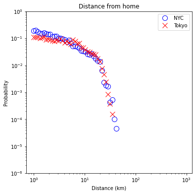

Human movement and mobility patterns have been studied on a global scale in the paper “Friendship and Mobility: User Movement in Location-Based Social Network.”  With the use of cell-phone location data as well as two online-based social networks (Gowalla and Brightkite), the authors revealed that human movement can be best summarized as a combination of local repetitive movements and random jumps that highly correlate with their social networks.
Here we’ll be diving into the complex phenomenon of human movement, but in a much more specific context: that of megalopolises!  Indeed, this extension studies the effect of human mobility in much more densely populated areas, New York City and Tokyo.

### The data used 
The data we acquired comes from the social media platform “Foursquare”.  This location-based social network provides us with the location and time of anonymous users living in New York City and Tokyo respectively.

_add logo foursquare!!_

### Goal
Many people move to attractive cities like New York City or Tokyo, looking for an out of habit experience.  But what is actually attractive about such big cities?  The clichés insist that such cities are always buzzing with life, a never ending diversity of activities, daily adventures 	and meeting new people every day.  Let’s find out if this is true!

Here are some interesting questions which we’ll dive into:
* Where do city-lovers live?  Are they all clustered in the same place?
* How far do people travel from their home?  Are they really discovering new places and being adventurous as they claim to be?
* What are these user’s routines? Do New Yorkers and Tokyoites cluster in specific parts of the city during the day?  When are these cities constantly alive and buzzing as they stereotypically seem to be?
* What activities are done in such megalopolises? How much diversity is there in the activities done?

## Where do city lovers live? Are they all clustered in the same space?
After associating home coordinates to each user, according to where they spend most of their time, let’s take a look at where these users live!  Can we identify residential areas?

_heatmap of homes, NY and TKY!!_

At first glance, it seems like there are no specific residential areas: the home distribution is quite uniform over both cities.  Indeed, given the high density of population, it would be quite hard to condense users in a single area!

## How far do people travel from their home?  Are they really discovering new places and being adventurous as they claim to be?

Now that we have estimated where every user lives, let’s see how far from their home they like to explore! Do they wander far off and discover new areas or do they restrict themselves to only their neighborhood?

_(Figure showing the probability distribution according the distance from home in km)!!_

Surprisingly, individuals don’t travel that far! According to the plot above, users tend to stay within less than 15 km from their home and rarely wander off.  How far does 15 km look like on a Tokyo and NYC map?

_(Add Tokyo map and NYC map with both a 15 km radius circle superimposed to show how far that distance can look like)!!_

If people don’t travel far, what are their habits in this more local environment?

## What are the routines and habits of individuals living in megalopolises?

Now let’s focus more on their daily routines: how do people move during the day and where are they located in NYC and Tokyo respectively?

Below are two interactive maps showing where people are distributed over these megalopolises during the day:

(add interactive maps with hour by hour evolution of all check-ins)

In these two maps, we can clearly notice that there is an increase in density during the day.  (add more conclusions: people in tokyo are flowing in much later than in nyc, then they leave around XXX hour)

